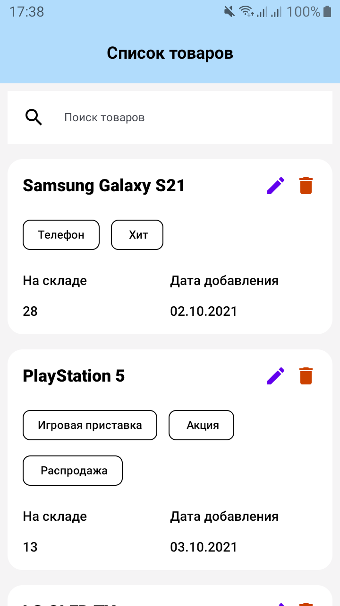
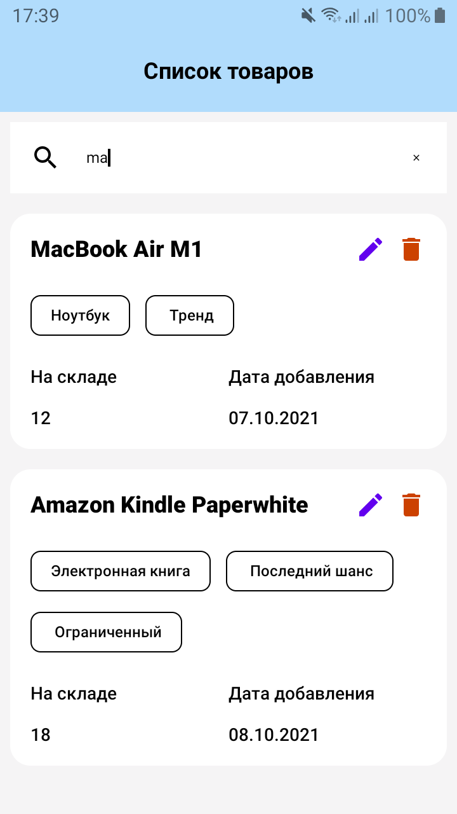
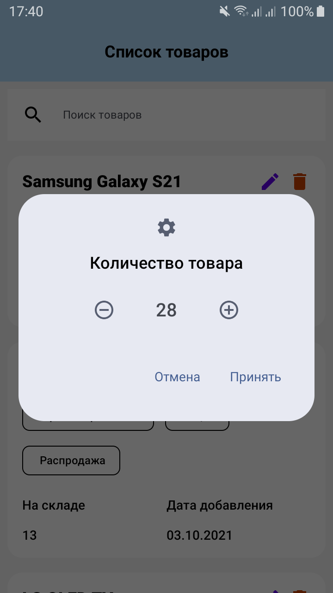

Тестовое приложение, состоит из одного экрана.

Архитектура MVVM.

Прменяемые технологии - Compose, Room

Асинхронная часть - Coroutines

DI - Dagger2

В приложении можно осуществлять поиск по наименованию товаров. Редактировать количество товара. Удалять карточки.

Приложение поддерживает переворот экрана.

Видео работы приложения

https://github.com/user-attachments/assets/55af228e-b673-45a1-9f75-cf42c03843c1

